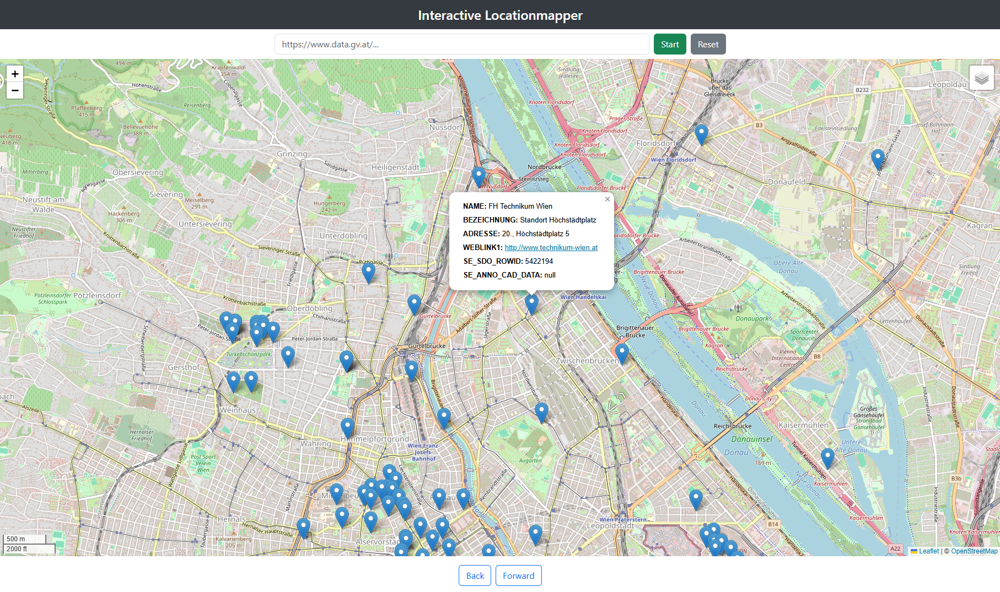

# Interactive Locationmapper
The Interactive Locationmapper is able to map Location data which are available in the format "WFS GetFeature (JSON)" which is GeoJSON with EPSG:4326.

Feel free to map some data using the Interactive Locationmapper via one of our deployed versions:

English Version: 
https://opendata.technikum-wien.at/locationmapper/

German Version: 
https://opendata.technikum-wien.at/locationmapper/de

